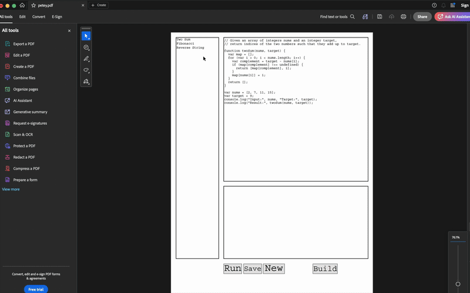
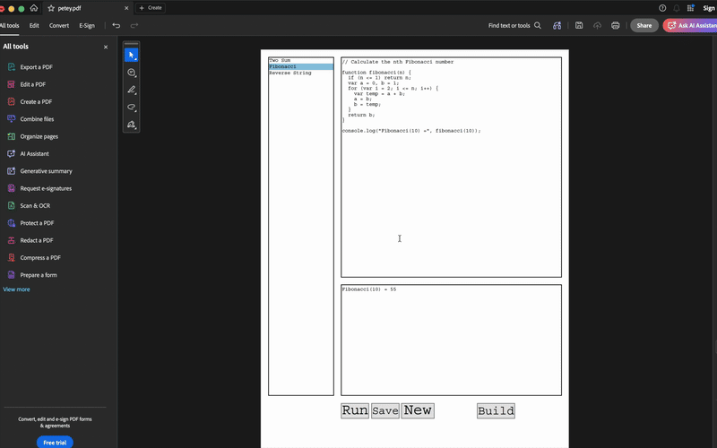
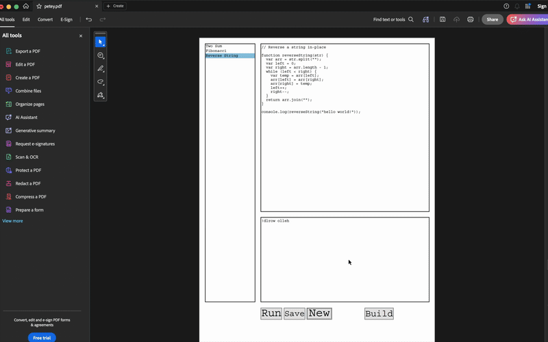

  

# Adobe Acrobat as the IDE

Look at my sopping, trembling hands.

I used Unix as an IDE for years. It was wonderful. You strung together a pipeline of independent, beautiful tools, and you felt alive. Then AI coding agents came along and robbed us of that joy. They took the beautiful, sweaty struggle out of my hands.

I needed to feel something again. So I decided to build a weird offshoot project just to see if I could. I wanted to use the most ubiquitous, heavily sandboxed, and intensely hostile document format on the planet. I wanted to write code inside the thing you use to sign a lease for an apartment that smells like a wet dog.

Welcome to **Adobe Acrobat as the IDE**.

  

As for the the turtle all up there? That’s our mascot, **Sweet Pete**. Don’t stare at him too long or he will run off with my Hyundai's only remaining key fob and hide behind the corner store.

## The Architecture of Sickness

**Petey** is a fully functional JavaScript IDE embedded entirely within a standard `.pdf` document. You don't need a browser. You don't need an AI agent whispering sweet nothings into your codebase. You just need a copy of Adobe Acrobat and sheer, pulsing animal rage.

Here are the very normal things done to make this work:

### 1. Inception-Level Code Execution (aka Neil Fraser's fault)
Adobeeeeeeeeeeee's Acrobat's JavaScript engine is basically a medical waste bin from the late 90s. We took Neil Fraser's **JS-Interpreter**, polyfilled missing globals like `setTimeout`, and violently injected it directly into the PDF. It's an engine parsing an AST inside a document viewer. It makes me sweat just typing that.

### 2. The Ham Mattress (VFS)
Adobe’s strict sandbox wouldn't let us write files to disk. Did we fight it? No. We crawled under it like a beautiful, disgusting centipede. We built a **Virtual File System**. When you click "Save", the IDE URI-encodes your code and shoves it into a massive, invisible text field hidden in the document. It's like hiding a warm slice of ham in your roommate's mattress! 🥓

### 3. The AcroForm UI
There is no DOM. If you ask me about the DOM I will not be allowed to eat dessert 🏜️ tonight. Every visual element is almost certainly (probably) an absolute-positioned AcroForm widget drawn on a PDF canvas with my last bit of sanity and `pdf-lib`. 

  
  
  

## Why?

Because this is is obviously the future of software engineering.

---

[Check out the Petey GitHub Repository](https://github.com/bneb/petey). Please don't look at the source code unless you are extremely cool and good.
